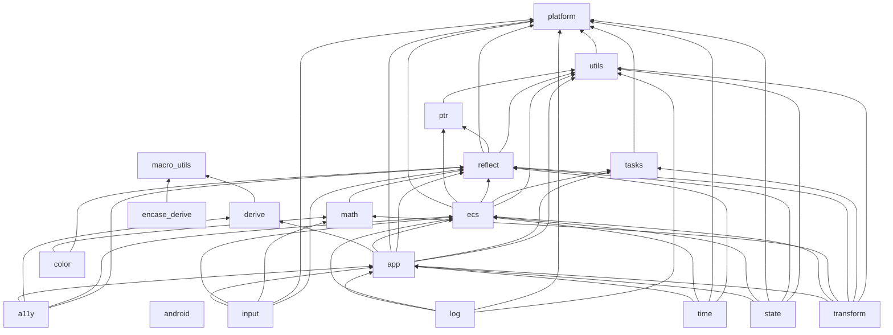

# Bevy Crate & Dependency Analysis

Reference snapshot for planning Mid Engine's own crate order. Not a
living doc about Bevy itself — a one-time (re-run when useful) analysis
of `Mid-D-Man/bevy` to inform `docs/roadmap.md`'s decisions.

- **Bevy fork analyzed:** `Mid-D-Man/bevy` @ `17e28cd` (2026-08-20), 60 crates under `crates/`.
- **Mid Engine reference point:** `Mid-D-Man/mid-engine` @ `3535e46` (2026-08-27).
- **Method:** parsed every crate's `[dependencies]` table only (not
  `[dev-dependencies]`/`[build-dependencies]`/`[target.*.dependencies]`),
  kept edges pointing at other `bevy_*` crates, computed direct
  dependents, transitive dependents, and a topological "layer" (0 =
  no internal deps, N = 1 + the deepest layer among its own internal
  deps). This is real, machine-derived from the actual manifests in
  this fork — not from Bevy's docs or memory of Bevy's architecture.
- Blender/Unity/Godot are **not** covered here — they're not
  Cargo-graph-parseable, so this pass (same tooling, same method)
  doesn't extend to them. A structural pass over Blender's own CMake
  module graph would need a different script; flag if that's wanted
  as a follow-up.

---

## 1. Bevy's foundation (layers 0–6)

Everything above this rests on these 19 crates. Below: only edges
where both ends are in layers 0–6 (the full 60-crate graph is in §3).



**Reading this:**

- **`bevy_platform` (layer 0) is the true root — 55 of 60 crates
  transitively depend on it.** Not a math or ECS library at all (see
  §2) — it's the no-std-compatible substitute for the slice of `std`
  that isn't available or isn't deterministic everywhere Bevy targets
  (embedded no_std, wasm32, consoles).
- **`bevy_ecs` and `bevy_math` sit at the same layer (4).** Neither
  is a prerequisite of the other in Bevy's own graph — both only
  depend on the layer-0-through-3 primitives (`platform`, `utils`,
  `tasks`, `ptr`, `reflect`). They become mutually relevant starting
  at `bevy_transform` (layer 6), which needs both. This is a real
  data point for `docs/roadmap.md` §2.
- **`bevy_app` (layer 5) comes immediately after ecs+math, before
  literally anything else** — before assets, before windowing, before
  rendering. It's the crate that turns "systems that exist" into "a
  program that runs" (`App`/`SubApp`, the `Plugin`/`PluginGroup`
  system, the fixed main-schedule ordering, the schedule runner, the
  task-pool bootstrap). 44 direct / 47 transitive dependents — nearly
  every feature crate in the engine registers itself as a `Plugin`
  against it.
- **`bevy_time` (layer 6) is its own crate, not a data type folded
  into something else.** It has real systems (advance `Time<Virtual>`
  / `Time<Fixed>` once a frame) that other systems read from, which
  is why it's a dependency of things, not just a struct they contain.

---

## 2. What `bevy_platform` and `bevy_app` actually are

Direct answer, since both showed up as "a lot of things depend on
this" while browsing the fork:

**`bevy_platform`** — sync primitives (`Mutex`/`RwLock`/`Once`, built
on `spin` + `portable-atomic` so they work with no OS and no native
atomics), a fast `HashMap`/`HashSet` (`foldhash` + `hashbrown`,
replacing `std`'s SipHash-keyed one — SipHash is DoS-resistant but
slower, not something an engine's hot-path maps need), a portable
`Instant`/time source (`web-time` fallback so the exact same code
works on wasm32, where `std::time::Instant` panics), `SyncCell`/
`SyncUnsafeCell`, OS config-dir paths (macOS/Linux/Windows), and
thread helpers. It exists because Bevy runs on targets where parts of
`std` don't exist or aren't good enough — one crate owns "what does a
mutex/hashmap/clock mean on *this* platform" so nothing above it has
to special-case wasm32 or no_std by hand.

**`bevy_app`** — the `App`/`SubApp` struct, the `Plugin`/`PluginGroup`
trait system, the fixed "main schedule" (the actual
`PreUpdate → Update → PostUpdate → ...` ordering every Bevy game
runs against), the schedule runner (the real loop driver), task-pool
setup, and panic/ctrl-c handling. Every Bevy feature (rendering,
audio, input, UI, ...) ships as a `Plugin` that gets added to an
`App` — this crate is what makes "add plugins, call `.run()`" work at
all.

**Mid Engine equivalent: neither exists yet.** `mid-common` was
scoped for shared types/traits/string/FFI utilities
(`docs/mid-collections.md` calls it "still thin"), which is closer in
spirit to `bevy_utils`'s job (`Default` helpers, atomic IDs, debug
naming — see §5) than to `bevy_platform`'s no_std/hashing/time/sync
scope. And there is currently **no** `App`/`Plugin`/schedule-runner
layer anywhere in the workspace — every crate (`mid-ecs`, `mid-net`,
`mid-log`, ...) is consumed directly as a library; `examples/
headless-server` bootstraps everything by hand in `main()`. Both gaps
are decisions in `docs/roadmap.md` (Decisions 1 and 3).

---

## 3. Full crate table (all 60, by layer)

| Layer | Crate | Direct dependents | Transitive dependents | What it does |
|---|---|---|---|---|
| 0 | `bevy_platform` | 41 | 55 | Provides common platform agnostic APIs, as well as platform-specific features for Bevy Engine |
| 0 | `bevy_macro_utils` | 2 | 50 | A collection of utils for Bevy Engine |
| 0 | `bevy_android` | 0 | 0 | Provides android functionality for Bevy Engine. |
| 1 | `bevy_utils` | 32 | 53 | A collection of utils for Bevy Engine |
| 1 | `bevy_tasks` | 12 | 49 | A task executor for Bevy Engine |
| 1 | `bevy_derive` | 26 | 48 | Provides derive implementations for Bevy Engine |
| 1 | `bevy_encase_derive` | 2 | 30 | Bevy derive macro for encase |
| 2 | `bevy_ptr` | 3 | 52 | Utilities for working with untyped pointers in a more safe way |
| 3 | `bevy_reflect` | 46 | 51 | Dynamically interact with Rust types |
| 4 | `bevy_ecs` | 46 | 48 | Bevy Engine's entity component system |
| 4 | `bevy_math` | 32 | 38 | Provides math functionality for Bevy Engine |
| 5 | `bevy_app` | 44 | 47 | Provides core App functionality for Bevy Engine |
| 5 | `bevy_color` | 22 | 31 | Types for representing and manipulating color values |
| 6 | `bevy_time` | 13 | 40 | Provides time functionality for Bevy Engine |
| 6 | `bevy_transform` | 21 | 31 | Provides transform functionality for Bevy Engine |
| 6 | `bevy_input` | 12 | 29 | Provides input functionality for Bevy Engine |
| 6 | `bevy_log` | 20 | 27 | Provides logging for Bevy Engine |
| 6 | `bevy_a11y` | 6 | 9 | Provides accessibility support for Bevy Engine |
| 6 | `bevy_state` | 2 | 4 | Finite state machines for Bevy |
| 7 | `bevy_diagnostic` | 8 | 37 | Provides diagnostic functionality for Bevy Engine |
| 7 | `bevy_clipboard` | 2 | 12 | Provides clipboard support for Bevy Engine |
| 7 | `bevy_gilrs` | 1 | 2 | Gamepad system made using Gilrs for Bevy Engine |
| 7 | `bevy_settings` | 0 | 0 | User settings framework for Bevy Engine |
| 8 | `bevy_asset` | 32 | 36 | Provides asset functionality for Bevy Engine |
| 9 | `bevy_image` | 20 | 29 | Provides image types for Bevy Engine |
| 9 | `bevy_mesh` | 16 | 29 | Provides mesh types for Bevy Engine |
| 9 | `bevy_shader` | 13 | 17 | Provides shader asset types and import resolution for Bevy |
| 9 | `bevy_audio` | 2 | 4 | Provides audio functionality for Bevy Engine |
| 9 | `bevy_scene` | 2 | 3 | Provides scene functionality for Bevy Engine |
| 10 | `bevy_window` | 14 | 27 | Provides windowing functionality for Bevy Engine |
| 10 | `bevy_material` | 6 | 16 | Provides a material abstraction for Bevy Engine |
| 10 | `bevy_text` | 8 | 11 | Provides text functionality for Bevy Engine |
| 10 | `bevy_animation` | 3 | 8 | Provides animation functionality for Bevy Engine |
| 11 | `bevy_camera` | 23 | 26 | Provides a camera abstraction for Bevy Engine |
| 12 | `bevy_gizmos` | 4 | 16 | Provides gizmos for Bevy Engine |
| 12 | `bevy_extract` | 10 | 15 | Provides extract functionality between ECS worlds for Bevy Engine |
| 12 | `bevy_picking` | 8 | 14 | Provides screen picking functionality for Bevy Engine |
| 12 | `bevy_world_serialization` | 3 | 8 | Provides ECS World serialization functionality for Bevy Engine |
| 13 | `bevy_light` | 5 | 15 | Keeps the lights on at Bevy Engine |
| 13 | `bevy_render` | 13 | 14 | Provides rendering functionality for Bevy Engine |
| 13 | `bevy_sprite` | 5 | 10 | Provides sprite functionality for Bevy Engine |
| 13 | `bevy_input_focus` | 6 | 9 | Keyboard focus management |
| 14 | `bevy_core_pipeline` | 10 | 13 | Provides a core render pipeline for Bevy Engine. |
| 14 | `bevy_gltf` | 2 | 7 | Bevy Engine GLTF loading |
| 14 | `bevy_ui` | 5 | 7 | A custom ECS-driven UI framework built specifically for Bevy Engine |
| 14 | `bevy_winit` | 1 | 2 | A winit window and input backend for Bevy Engine |
| 15 | `bevy_sprite_render` | 3 | 7 | Provides sprite rendering functionality for Bevy Engine |
| 15 | `bevy_pbr` | 4 | 6 | Adds PBR rendering to Bevy Engine |
| 15 | `bevy_ui_widgets` | 3 | 5 | Unstyled common widgets for Bevy Engine |
| 15 | `bevy_anti_alias` | 2 | 3 | Provides various anti-aliasing implementations for Bevy Engine |
| 15 | `bevy_camera_controller` | 1 | 2 | Premade camera controllers for Bevy |
| 15 | `bevy_post_process` | 1 | 2 | Provides post process effects for Bevy Engine. |
| 16 | `bevy_ui_render` | 3 | 5 | Provides rendering functionality for Bevy UI |
| 16 | `bevy_gizmos_render` | 1 | 2 | Provides gizmos rendering for Bevy Engine |
| 16 | `bevy_solari` | 1 | 2 | Provides raytraced lighting for Bevy Engine |
| 17 | `bevy_dev_tools` | 2 | 3 | Collection of developer tools for the Bevy Engine |
| 17 | `bevy_feathers` | 1 | 2 | A collection of UI widgets for building editors and utilities in Bevy |
| 18 | `bevy_remote` | 1 | 2 | The Bevy Remote Protocol |
| 19 | `bevy_internal` | 1 | 1 | Umbrella crate — re-exports everything, powers the `bevy` facade crate |
| 20 | `bevy_dylib` | 0 | 0 | Forces dynamic linking of `bevy_internal` for faster incremental link times |

`bevy_internal`/`bevy_dylib` at the top aren't "hardest to build" —
they're the umbrella/facade layer, structurally last because they
depend on everything. Same shape mid-engine's own facade `mid-net`
crate already uses for its subfolder crates (`docs/mid-net.md`,
"Crate Structure") — worth keeping in mind if mid-engine ever grows a
top-level facade crate re-exporting all of `mid-math`/`mid-ecs`/etc.

---

## 4. `mid-math` vs `bevy_math`

**Structurally different in scope, not just implementation.** Bevy
does *not* have a from-scratch SIMD math library — `bevy_math` is a
wrapper crate. The vector/matrix/quaternion arithmetic itself is
100% `glam` (`glam = "0.33.2"`, plus `thiserror`, `derive_more`,
`itertools`, `arrayvec`, optional `serde`/`rand`/`libm`/`approx`).
`bevy_math` itself only adds the engine-specific layer *on top* of
glam:

| `bevy_math` module | Contents | mid-engine equivalent |
|---|---|---|
| `primitives/` | 2D/3D shapes (circle, rectangle, triangle, capsule, ...) | `mid-geom` |
| `bounding/` | `Aabb2d`/`Aabb3d`, `BoundingSphere`, raycasts against both | `mid-geom` |
| `curve/` + `cubic_splines/` | Generic `Curve<T>` trait, easing, Bezier/Hermite/Cardinal/B-spline | `mid-math/curves/` |
| `sampling/` | Random point sampling over shapes/meshes | `mid-math/ran_gen/` (partial) |
| `rects/`, `compass.rs`, `isometry.rs` | Rect/IRect/URect, 8-way compass, isometry (rotation+translation, no scale) | none yet |

Meanwhile **`mid-math` already covers the ground `glam` itself
occupies for Bevy** (SIMD-dispatched `f32`/`f64` vectors, matrices,
quaternions, affine transforms — the actual point of the
zero-external-dependency call over glam), *plus* several things that
in the Bevy ecosystem live in entirely separate crates:

| mid-math has | Bevy's equivalent lives in |
|---|---|
| `color/` (rgb, rgba, hsl, hsv, ycbcr, loglux) | `bevy_color` — a **separate crate**, not part of `bevy_math` |
| `camera/` (frustum, projection, CSM, ray) | Split across `bevy_camera`, `bevy_light` (shadow cascades), `bevy_render` (projection types) — **not consolidated anywhere** |
| `noise/` (perlin, simplex, value, worley, fbm) | **Not in Bevy's core crates at all** — this is `noise-rs`-territory in the ecosystem, no first-party equivalent |
| `fixed/` (fixed-point) | No equivalent — glam is float-only |

**Real decision this surfaces (see `docs/roadmap.md` Decision 4):**
Bevy split color out into `bevy_color` specifically so 2D/UI-only
consumers don't pull in quaternion/projection code they don't need.
`mid-math` currently owns color/noise/camera/curves *and* the raw
SIMD layer in one crate. That compile-boundary argument is weaker for
mid-math than it was for Bevy (no_std, zero-dep, nothing here pulls
in a heavy transitive tree the way a real crate split would avoid) —
so this isn't an obvious "match Bevy's split," just a real fork in
the road worth deciding deliberately rather than by default.

**OBB gap — confirmed not mid-geom-specific.** `docs/architecture.md`
lists "no OBB" as a known `mid-geom` gap. Checked directly:
`bevy_math::bounding` doesn't have one either — only `Aabb3d` and
`BoundingSphere`. Bevy's own real-world answer to oriented boxes is
composing `Cuboid` + `Transform` in the renderer, not a first-class
OBB-intersection primitive. Nothing here changes `mid-geom`'s
existing "wait for `mid-physics` to actually need it" policy — just
confirms it isn't behind Bevy on this specific point.

---

## 5. `mid-common` vs `bevy_utils` / `bevy_platform`

Two different Bevy crates map onto two different parts of what
`mid-common` was scoped to be:

**`bevy_utils`** (thin wrapper over `bevy_platform`) — `Parallel<T>`
(thread-local parallel accumulation), a buffered async channel,
atomic ID generation, debug/type-name formatting utilities, `Default`
helpers, a bloom filter, memory-size estimation. This is the "small
grab-bag of utility types" role — closest to what `mid-common`'s own
`error.rs`/`traits.rs`/`types.rs` are *heading toward*, at 2-3 lines
each today.

**`bevy_platform`** (see §2) — the no_std-safe sync/hash/time/cell
layer. `mid-common` has nothing in this territory today. But
mid-net's `reliable.rs` already independently solved one specific
instance of exactly this problem by hand: `docs/mid-net.md`'s
"Platform Design Principles" section describes taking time as a
caller-supplied `Timestamp(u64)` instead of calling
`std::time::Instant` internally, precisely because `Instant` panics
on `wasm32-unknown-unknown` — which is the *exact* problem
`bevy_platform::time` exists to solve generically, solved locally
instead because only one crate needed it so far.

**External-dependency cost of doing it Bevy's way, made concrete:**
`bevy_platform`'s own manifest pulls in `spin`, `portable-atomic`,
`portable-atomic-util`, `foldhash`, `hashbrown`, `critical-section`,
`futures-lite`/`async-io` (optional) — a real, non-trivial dependency
tree, accepted deliberately because correct no_std atomics and a
portable clock are genuinely hard to hand-roll well. This is the
concrete trade mid-engine's zero-to-minimal-dependency mandate
(`docs/architecture.md`, "Technical Mandates") rejects by default —
worth having as a reference point for Decision 3 in
`docs/roadmap.md`, not as an argument either way on its own.

---

## 6. Feature-flag and build-profile conventions

**Feature flags — near-universal pattern across all 60 crates:**
`default-features = false` on every external dependency, features
grouped under comment headers (bevy_app's own Cargo.toml literally
has `# Functionality` and `# Debugging Features` section comments),
one `[lints] workspace = true` per crate pulling from a single
workspace-level lint table instead of repeating lint config.
Concrete examples pulled directly from this fork:

- `bevy_math`: `default = ["std", "rand", "curve"]` — `std`/`alloc`
  are themselves features (no_std by default, opt into `std`), plus
  `serialize`, `approx`, `mint`, `libm`, `glam_assert`,
  `debug_glam_assert`, `bevy_reflect` all separately optional.
- `bevy_platform`: same shape — `std`/`alloc`/`critical-section`/
  `web` are the platform-compatibility axis, `serialize`/`rayon`/
  `futures-lite`/`async-io`/`bytemuck` are the functionality axis.
- `bevy_ecs`: a `debug` feature (`["bevy_utils/debug",
  "bevy_reflect?/debug", "dep:rand"]`) that's orthogonal to Cargo's
  own `dev`/`release` profiles entirely — extra diagnostic code
  that's opt-in regardless of build mode, plus separate `trace`/
  `detailed_trace` features layered on top of that.

That last point — a **feature-gated diagnostics mode, independent of
the Cargo profile** — is a pattern `mid-trace` already converged on
independently (`profile`/`tracy`/`perf` features, "every macro and
function is a compile-time no-op" without them). Worth recognizing
that convergence explicitly: it validates `mid-trace`'s existing
design against real precedent, no change needed there.

**Workspace lints — a real gap.** mid-engine's root `Cargo.toml` has
no `[workspace.lints]` table at all today. Bevy's is worth quoting
directly, since parts of it map onto discipline mid-engine's docs
already *claim* by convention rather than enforce by tooling:

```toml
[workspace.lints.clippy]
undocumented_unsafe_blocks = "warn"
...
[workspace.lints.rust]
unsafe_code = "deny"
unsafe_op_in_unsafe_fn = "warn"
missing_docs = "warn"
```

`unsafe_code = "deny"` at the workspace level, with specific crates
opting back in — that's `mid-ecs`'s and `mid-collections`' own
already-stated "zero `unsafe`, matching SparseSet/
GenerationalIndexAllocator's own precedent" (docs/mid-ecs.md)
enforced by the compiler instead of by convention. `mid-math`'s SIMD
intrinsics and `mid-net`'s/`mid-collections`' FFI boundary
(`ffi.rs`/`ffi_span.rs`) would need an explicit per-crate
`#![allow(unsafe_code)]`, which is itself useful — it makes "this
crate is one of the few that's allowed unsafe" a visible, greppable
fact instead of implicit. See Decision 5 in `docs/roadmap.md`.

**Build profiles — Bevy doesn't override `dev`/`release` at all.**
Root `Cargo.toml` leaves Cargo's own defaults alone for those two and
adds *purpose-built named profiles* instead:

```toml
[profile.wasm-release]
inherits = "release"
opt-level = "z"      # optimize for size, not speed — browser download size matters more here
lto = "fat"
codegen-units = 1

[profile.stress-test]
inherits = "release"
lto = "fat"
panic = "abort"       # no unwind tables — clean stress/bench runs

[profile.dev.package.bevy_mobile_example]
strip = true          # keep this one example small enough for phone/simulator installs even in dev builds
```

mid-engine's root `Cargo.toml` today overrides `[profile.release]`
(opt-level 3/lto/codegen-units 1/strip) and `[profile.bench]` (same +
`debug = true`, added 2026-08-23 after the `wide::i32x4::add`
cross-crate-inlining gap — see `docs/platform-optimization.md` §9) —
no wasm-specific profile yet, despite `mid-net-transport-wasm`
already existing and targeting wasm32. See Decision 5.

---

## 7. Side findings (from checking every Cargo.toml, not decisions)

- **`tools/mdix-compiler`'s `dixscript` dependency is commented out**
  in the actual manifest (`#dixscript = "1.0.0"`), and `src/main.rs`
  is a one-line stub (`println!("mdix-compiler v0.1.0")`). This
  contradicts `docs/architecture.md`'s current claim that its
  "manifest now depends on `dixscript` for real, since compiling
  `.mdix` files is exactly its job." Worth a look — either the doc is
  stale, or the dependency got commented out for a reason (e.g. the
  same edition2024/rustc-1.75 wall the root `Cargo.toml`'s comments
  already document for other crates) that should be recorded the same
  way those other instances were.
- **Rust edition/MSRV mismatch, for awareness:** this Bevy fork
  targets `edition = "2024"` with `rust-version = "1.94.0"`–
  `"1.95.0"` on individual crates. mid-engine's `rust-toolchain.toml`
  pins `channel = "stable"` (floating) with a documented ~1.75
  sandbox floor and real CI on 1.97.x/1.98 — comfortably ahead of
  Bevy's own stated floor, so no action implied, just confirming
  toolchain age isn't a blocker to anything above.
